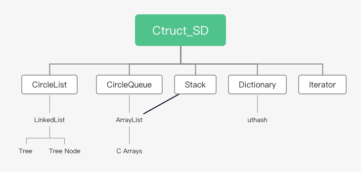

<h3 align="center">纯C语言的多种数据结构——Ctruct</h3>

---

 这是一个由纯C编写的多种数据结构项目，项目起初是用于学习，后可拓展到嵌入式编程领域。我感觉还是用于学习比较好，因为它的适用场景并不多。
      

visit github project <a href="https://github.com/TIMESTICKING/Ctruct_SD">here</a>

## 📝 Table of Contents

- [About](#about)
- [Topology](#topology)

## 🧐 About 

项目采用结构体来***模拟面向对象***的编程方式，但受语言限制，“方法”仍需传入“类”自身。同时下标采用了负数表示法，例如-1表示最后一个元素。 
项目包含的数据结构可以存储***任意类型***的数据，因为存数据的指针是`void`类型。同时也支持静态和动态初始化。 
数据结构有，可***自动扩展长度***的`ArrayList`、双向链表`LinkedList`、双向循环链表`CircleList`、环形队列`CircleQueue`、***任意叉***树`Tree`、栈`Stack`、字典（基于<a href="https://troydhanson.github.io/uthash/">uthash</a>）`Dictionary`。  
设计模式有，迭代器`Iterator`。

## 🔭 Topology 

各结构的“继承”关系如下 

